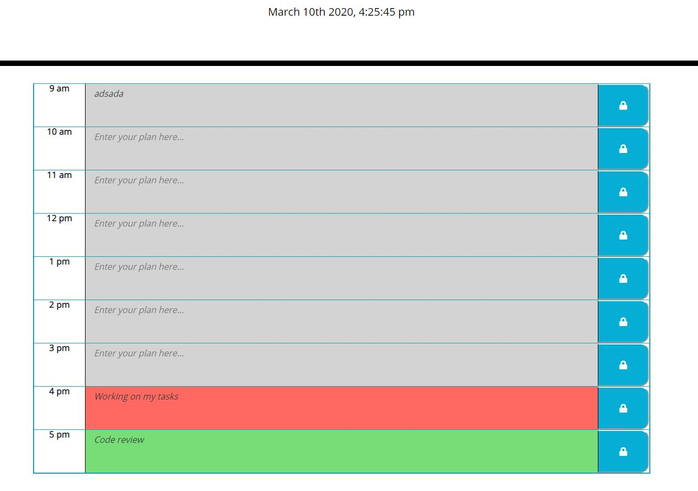

# Assignment 5  Work Day Scheduler

A simple calendar application that allows the user to save events for each hour of the day. 


```
After open the planner, current day is displayed at the top of the calendar
If I scroll down, the timeblocks for standard business hours will be presented
Viewing the timeblocks for that day, each timeblock is color coded to indicate whether it is in the past, present, or future
When click into a timeblock, user could enter logs, logs will be stored for the browser after click on the lock button.
```

```
The following is a screen capture of the web application:
    - The past time slots background is grey
    - The present time slots background is red
    - The future time slots background is green
```



This app runs in the browser and features dynamically updated HTML and CSS powered by jQuery.
For details about jQuery, visit: https://jquery.com/
This app uses a third party library 'Moment.js', for details about moment.js, visit https://momentjs.com/


